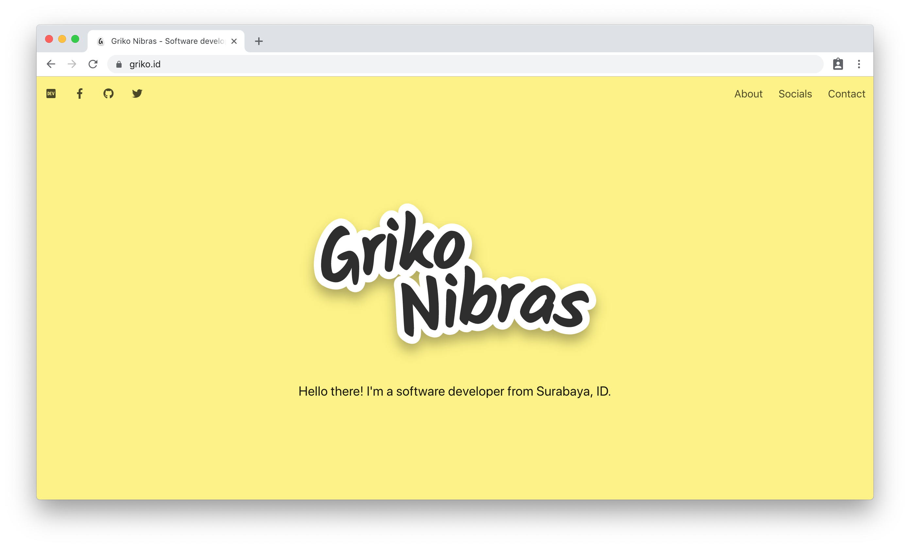

# landing-page

Personal landing page, powered with [Next.js](https://github.com/zeit/next.js) ✨

## Description

After many iterations and deployments throughout many providers, I decided to
optimize my landing page and host statically it on GitHub Pages. Oh and also
this got featured on [Bulma Expo](https://bulma.io/expo/). 😄

## Development

### Requirements

- [Node.js](https://nodejs.org/en/)
- [Yarn](https://yarnpkg.com/en/) (recommended)

### Steps

- Clone this repository
- Install dependencies using Yarn
- Start dev server by running `yarn dev`
- Lint source codes using `yarn lint`
- Build and export using `yarn export` (creates `out` directory)

### Publishing

- Add a `.nojekyll` file in `out` directory if publishing on GitHub Pages
- Publish the `out` directory contents anywhere
  (GitHub Pages, [Netlify](https://www.netlify.com/), Surge.sh, [Zeit Now](https://zeit.co/now), etc.)

## Libraries and Packages

### Dependencies

- [Bulma](https://bulma.io/)
- [EmojiOne](https://www.emojione.com/emoji/v4)
- [Font Awesome](https://fontawesome.com/)
- [Next.js](https://github.com/zeit/next.js)
- [`illinois/next-page-transitions`](https://github.com/illinois/next-page-transitions)
- [`react-reveal`](https://github.com/rnosov/react-reveal)
- [`sass/node-sass`](https://github.com/sass/node-sass)

### Dev Dependencies

- [`@types/react`](https://www.yarnpkg.com/en/package/@types/react)
- [`@types/react-dom`](https://www.yarnpkg.com/en/package/@types/react-dom)
- [Prettier](https://prettier.io/)
- [`PropTypes`](https://www.yarnpkg.com/en/package/prop-types)

View more details on the [`package.json`](./package.json) file.

## Tools of the Trade

- Countless coffee
- Google Chrome
- Hyper
- Sleepless nights
- Visual Studio Code

## Credits

Big thanks for all the listed packages above, especially [Jeremy Thomas](https://github.com/jgthms)
for creating Bulma and all of the [Zeit](https://zeit.co/home) team for Next.js! 🎉
