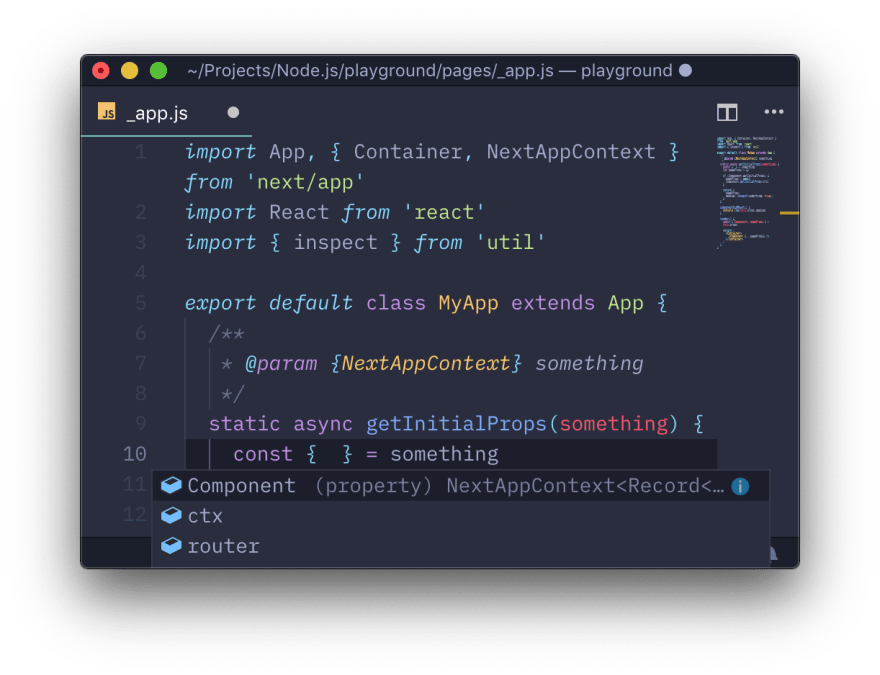
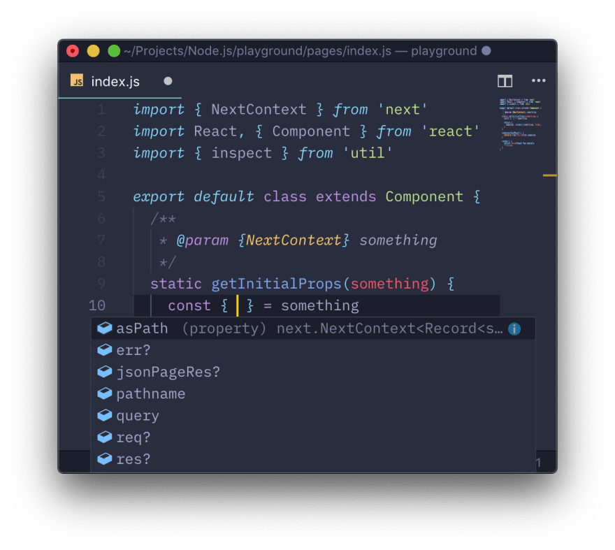

> This is a rewrite of my [original post on Medium](https://medium.com/@griko/exploring-undocumented-getinitialprops-properties-on-next-js-1265a6abc652) with several minor edits.

Some time ago, I was working on a [Next.js](https://nextjs.org/)-based web app. One of the plus one features of Next.js is that it supports [initial data population](https://github.com/zeit/next.js#fetching-data-and-component-lifecycle) using the `getInitialProps` static method, which means that you can populate the component `props` before loading the page (e.g. fetching news feeds).

At their official documentation on ["Fetching data and component lifecycle"](https://github.com/zeit/next.js#fetching-data-and-component-lifecycle) part, it shows how to use `getInitialProps` and what parameters that can be destructured. A screenshot from their readme:


Pretty straightforward, right? Except for one minor problem.

## Something’s not right 🔥

On another part of the readme which explains on how to use a custom `App` component on `_app.js`, it also uses `getInitialProps` but with different destructured context parameters. Here's the [code snippet from the readme](https://github.com/zeit/next.js#custom-app):

```js
static async getInitialProps({ Component, router, ctx }) {
  let pageProps = {}

  if (Component.getInitialProps) {
    pageProps = await Component.getInitialProps(ctx)
  }

  return { pageProps }
}
```

From the snippet above, it shows that `getInitialProps` doesn't use the documented object properties. And also it seems that I'm not the only one confused about this. Quoting from [a discussion on a Spectrum thread](https://spectrum.chat/?t=07e9ab0e-0fae-43a8-8bc0-350c79e921a3):

> What damn are and where are coming from the following properties of the context parameter?

So for weeks, I searched the Next.js codebase and issues, even Spectrum threads related to `getInitialProps`. And in this post I will try my best to explain the `getInitialProps` debacle.

## Inspecting and dumping ✨

In [another Spectrum thread that I created](https://spectrum.chat/?t=bd0da841-05f0-4b3b-8f1f-9e6b16b1952b), [@revskill](https://spectrum.chat/users/revskill) recommends using [`util.inspect`](https://nodejs.org/api/util.html#util_util_inspect_object_options) to analyze objects. So I made a temporary page (`pages/temp.js`) and use this snippet below to dump the `getInitialProps` parameter using `util.inspect`:

```js
import React, { Component } from 'react'
import { inspect } from 'util'

export default class extends Component {
  static getInitialProps(something) {
    return {
      pageLog: inspect(something, true, 0),
    }
  }

  componentDidMount() {
    console.log(this.props.pageLog)
  }

  render() {
    return <pre>Check the console ^^</pre>
  }
}
```

Checking the console, it returns this:

```js
{ err: undefined,
  req: [Object],
  res: [Object],
  pathname: '/',
  query: {},
  asPath: '/' }
```

All properties shown are already documented on the readme, so where’s `Component`, `router`, and `ctx`? Because the readme shows that those three properties are used on a custom `App`, so I made `pages/_app.js` and dump the parameter on `getInitialProps` like before:

```js
import App, { Container } from 'next/app'
import React from 'react'
import { inspect } from 'util'

export default class MyApp extends App {
  static async getInitialProps(something) {
    const { Component, ctx } = something
    let pageProps = {}

    if (Component.getInitialProps) {
      pageProps = await Component.getInitialProps(ctx)
    }

    return {
      pageProps,
      appLog: inspect(something, true, 0),
    }
  }

  componentDidMount() {
    console.log(this.props.appLog)
  }

  render() {
    const { Component, pageProps } = this.props

    return (
      <Container>
        <Component {...pageProps} />
      </Container>
    )
  }
}
```

Now the console returns two logs:

```js
{ err: undefined,
  req: [Object],
  res: [Object],
  pathname: '/',
  query: {},
  asPath: '/' }

{ Component: [Object], router: [Object], ctx: [Object] }
```

As you can see on the snippet above, I destructured two properties: `Component` and `ctx`. So from my understanding is that the `Component` object is the page component that will be loaded (e.g. `pages/index.js`), and the `ctx` object is the `App` context (which explains why it has a `router` property). Note the `if (Component.getInitialProps)`, it's quite obvious that what it does is checks whether the page component has a `getInitialProps` function to run.

So what that means is the `getInitialProps` parameter (or context) differs from a page component. But this doesn't explain another thing.

## Type? What type? 🐴

I’m a sucker for object types, so it really bothers me when statically adding `getInitialProps` to an `App` or page component obviously doesn't give any hints on my editor. And after inspecting a lot above, at some point I asked myself, "does `next` has a `@types` package?" [And they have!](https://www.yarnpkg.com/en/package/@types/next) Why did I bother inspecting ony by one?

After that sudden realization, I added the type package and checked whether it has an object or interface with the name 'context' using the IntelliSense extensions on Visual Studio Code. Lo and behold, I found three interfaces 'context' related:

```js
import { NextContext } from 'next'
import { AppComponentContext, NextAppContext } from 'next/app'
```

After finding those three, I tried type hinting the `getInitialProps` function on both `_app.js` and a page component, and the results was fantastic:





Much better! Now I have found out that it has a `@types` package, getting to know more about its type and contents is much easier.

## Getting to know more 🚀

In Visual Studio code, with the right extensions installed, you can jump to the definition of the type by command or control clicking the variable like below:

<!-- markdownlint-disable MD033 -->

<figure class="image">
  
</figure>

From the GIF above, it opens the declaration files in the `node_modules` directory in `node_modules/@types/next`. Or you can view the file on the [`@types/next` repository on GitHub](https://github.com/DefinitelyTyped/DefinitelyTyped/blob/master/types/next/index.d.ts). Here's a snippet from the declaration files for the context object on the `App` component (`NextAppContext`):

```js
/**
 * Context passed to App.getInitialProps.
 * Component is dynamic - cannot infer type.
 *
 * @template Q Query object schema.
 */
export interface NextAppContext<Q extends DefaultQuery = DefaultQuery> {
    Component: NextComponentType<any, any, NextContext<Q>>;
    router: RouterProps<Q>;
    ctx: NextContext<Q>;
}
```

And here’s the context declaration for page components (`NextContext`):

```js
/**
 * Context object used in methods like `getInitialProps()`
 * https://github.com/zeit/next.js/blob/7.0.0/server/render.js#L97
 * https://github.com/zeit/next.js/blob/7.0.0/README.md#fetching-data-and-component-lifecycle
 *
 * @template Q Query object schema.
 */
interface NextContext<Q extends DefaultQuery = DefaultQuery> {
    /** path section of URL */
    pathname: string;
    /** query string section of URL parsed as an object */
    query: Q;
    /** String of the actual path (including the query) shows in the browser */
    asPath: string;
    /** HTTP request object (server only) */
    req?: http.IncomingMessage;
    /** HTTP response object (server only) */
    res?: http.ServerResponse;
    /** Fetch Response object (client only) - from https://developer.mozilla.org/en-US/docs/Web/API/Response */
    jsonPageRes?: NodeResponse;
    /** Error object if any error is encountered during the rendering */
    err?: Error;
}
```

That’s much better than inspecting objects one by one. Hopefully this adventure log isn’t that confusing, since `getInitialProps` is already confusing at the start. Thanks for reading, and happy coding! 👋🏻
